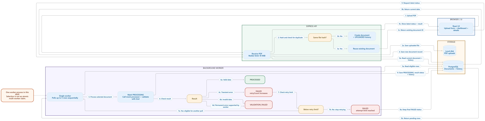

# End-to-end flow

This diagram follows a document from browser upload through asynchronous processing and status display.

Upload and duplicate detection happen during the API request. The worker then processes eligible documents sequentially and records status history. The frontend polls for updates and displays the document status, result, and timeline. The diagram summarizes the main flow; the detailed request and response interactions are in the [sequence diagram](./sequence_diagram.png).

The worker stage is grouped at this overview level. In code, it first saves `PROCESSING` and its history, then calls the processor and validates the result, then saves the outcome and its history.

Transient failures can be retried up to three total attempts. Invalid extracted data becomes `VALIDATION_FAILED`; an exhausted transient failure remains `FAILED`. A document stuck in `PROCESSING` for over five minutes is recovered and the recovery consumes an attempt. The worker is one loop in the backend process, not a horizontally safe multi-worker claim. The mock processor simulates outcomes and does not inspect PDF contents.
